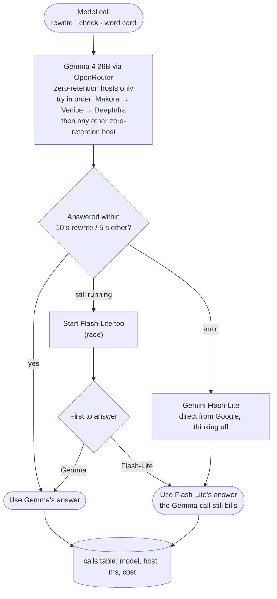

# Model call routing: how every model call gets answered fast

Decision: PRD D49 (2026-09-28). Code: `src/generate.py` (`PRIMARY`, `FALLBACK`, `HEDGE_AFTER`,
`call_model`). Watch it: `python -m service.speed [days]` (run from `src/`).

## Why

- OpenRouter's default host pick is weighted towards the cheapest host, not the fastest. The
  same rewrite took 10–118 s across hosts (probe, 2026-09-28), and fast hosts sometimes refuse
  with "too many requests".
- Sorting by throughput made things slower (runs 41/42), so the order is set from our own
  measurements instead.
- A fixed host order still depends on those hosts having capacity; the race with Flash-Lite
  caps the wait when they don't.
- Not permanent (founder): the model market moves weekly. Re-check with the speed report and
  `src/evals`, and change the order or the models when the numbers say so.
