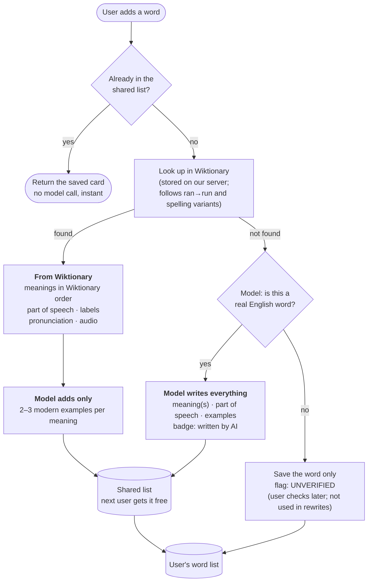

# Word capture: where a word card comes from

Decision: PRD D48 (2026-09-27). Research and spike numbers: `docs/content-sources.md`,
"Dictionary sources for word cards".

## Rules the diagram encodes

- **Dictionary for facts, model for examples.** Definitions and pronunciation come from
  Wiktionary whenever it has the word; the model never rewrites them. The model always writes
  the examples, because only 62% of the founder's 235 words have a modern Wiktionary example,
  usually on the literal sense.
- **At most one model call per new word, zero for a word already in the shared list.**
- **Unverified words stay private.** They never enter the shared list, so one user's typo
  cannot become everyone's entry.
- **Meaning order is Wiktionary's**, minus senses tagged archaic, obsolete, rare or dated.
  Picking the meaning the user intended (from the sentence it came from) is deferred.
